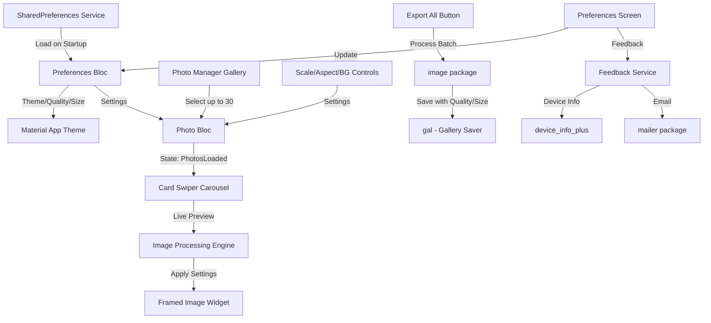

# Instagram Photo Framer - V1.0 MVP Implementation Plan

## Architecture Overview



## Core Components

### 1. Project Setup & Dependencies

**File: [`pubspec.yaml`](pubspec.yaml)**

Add dependencies:

- `flutter_bloc: ^8.1.3` - State management
- `photo_manager: ^3.0.0` + `wechat_assets_picker: ^9.0.0` - Multi-select gallery
- `image: ^4.1.0` - Image processing (resize, crop, blur)
- `card_swiper: ^3.0.1` - Carousel
- `flex_color_scheme: ^7.3.1` - Advanced theming with Material 3
- `gal: ^2.3.0` - Save to gallery
- `path_provider: ^2.1.0` - Temp file storage
- `shared_preferences: ^2.2.0` - Persist user preferences
- `mailer: ^6.0.0` - Send feedback emails
- `device_info_plus: ^10.0.0` - Get device info for feedback

Update `AndroidManifest.xml` with permissions:

- `READ_MEDIA_IMAGES` (Android 13+)
- `READ_EXTERNAL_STORAGE` (Android 12-)
- `WRITE_EXTERNAL_STORAGE` (Android 9-)

### 2. BLoC State Management Architecture

**Files to create:**

- `lib/blocs/photo_bloc/photo_bloc.dart`
- `lib/blocs/photo_bloc/photo_event.dart`
- `lib/blocs/photo_bloc/photo_state.dart`

**Events:**

- `LoadPhotosFromGalleryEvent` - Trigger photo picker
- `PhotosSelectedEvent(List<AssetEntity>)` - Store selected photos
- `UpdatePhotoSettingsEvent(settings)` - Update processing settings
- `UpdateAspectRatioEvent(aspectRatio)` - Update aspect ratio only
- `UpdateScaleEvent(scale)` - Update scale only
- `UpdateBackgroundTypeEvent(bgType)` - Update background only
- `UpdateCurrentIndexEvent(index)` - Update carousel position
- `ExportAllPhotosEvent` - Batch process and save
- `ClearPhotosEvent` - Reset to initial state

**Note:** All events end with "Event" suffix for clarity (BLoC newcomer friendly)

**States:**

- `PhotoInitialState` - No photos selected yet
- `PhotosLoadingState` - Gallery picker is active
- `PhotosLoadedState(photos, settings, currentIndex)` - Photos ready for editing
- `PhotosProcessingState(progress)` - Batch export in progress
- `PhotosExportedState(count)` - Export completed successfully
- `PhotoErrorState(message)` - Error occurred

**Note:** All states end with "State" suffix for clarity (BLoC newcomer friendly)

**Settings Model:**

```dart
class PhotoSettings {
  final AspectRatio aspectRatio; // 4:5 or 1:1
  final double scale; // 0.0 to 1.0 (100% = fill completely)
  final BackgroundType bgType; // white, black, extendedBlur
  final int imageQuality; // 1-100 (JPEG quality)
  final ImageSize imageSize; // preset or custom dimensions
}
```

### 3. Gallery Picker Integration

**File: `lib/screens/photo_picker_screen.dart`**

Use `wechat_assets_picker` to:

- Multi-select up to 30 photos
- Request Android permissions (photo_manager)
- Return `List<AssetEntity>` to PhotoBloc
- Handle permission denied gracefully

### 4. Main Editor Screen

**File: `lib/screens/editor_screen.dart`**

Layout structure:

```
AppBar (title, photo count)
├─ CardSwiper (70% height)
│   └─ ProcessedImageWidget (shows live preview)
├─ Control Panel (30% height)
│   ├─ Aspect Ratio Buttons (4:5, 1:1)
│   ├─ Scale Slider (0-100%)
│   ├─ Background Chips (White, Black, Blur)
│   └─ Export All Button
└─ Page Indicator (1/30)
```

### 5. Image Processing Engine

**File: `lib/services/image_processor.dart`**

Core function:

```dart
Future<Uint8List> processImage(
  AssetEntity asset,
  PhotoSettings settings,
) async {
  // 1. Load original image bytes
  // 2. Decode using image package
  // 3. Calculate target dimensions (4:5 or 1:1)
  // 4. Create canvas with target size
  // 5. Apply background:
  //    - white/black: fill canvas
  //    - extendedBlur: extend edges + blur
  // 6. Scale and center original photo
  // 7. Encode to JPEG
  // 8. Return bytes
}
```

**Extended Blur Implementation:**

- Resize original to target dimensions (stretches edges)
- Apply Gaussian blur (radius ~25)
- Overlay scaled original photo on top

### 6. Live Preview Widget

**File: `lib/widgets/processed_image_widget.dart`**

- Displays current photo with applied settings
- Uses `FutureBuilder` to show loading while processing
- Caches processed images to avoid reprocessing on swipe-back
- Shows original photo dimensions as overlay

### 7. Export Functionality

**File: `lib/services/export_service.dart`**

Batch export flow:

1. Show progress dialog (0/30)
2. Process each photo sequentially (avoid memory issues)
3. Save to temp directory first
4. Use `gal` to save to gallery
5. Clean up temp files
6. Show completion snackbar

### 8. Preferences Screen & Settings

**File: `lib/screens/preferences_screen.dart`**

Settings available:

1. **Theme Mode** - Auto/Light/Dark (enum: `ThemeMode`)
2. **Image Quality Slider** - 1-100% (affects JPEG encoding)
3. **Image Size Presets:**
   - Instagram Portrait - 1080x1350
   - Instagram Square - 1080x1080
   - Instagram Landscape - 1080x566
   - High Quality Portrait - 1440x1800
   - High Quality Square - 1440x1440
   - Custom (dropdown reveals width/height inputs)
4. **Feedback Option** - Opens email composer with:
   - To: your-email@example.com
   - Subject: "InstaFrame Feedback"
   - Body pre-filled with: App version, Android version, device model, screen size

**File: `lib/blocs/preferences_bloc/preferences_bloc.dart`**

- Load preferences from `shared_preferences` on app start
- Events: `LoadPreferences`, `UpdateTheme`, `UpdateQuality`, `UpdateImageSize`
- States: `PreferencesLoaded(UserPreferences)`
- Persist changes immediately to storage

**File: `lib/services/feedback_service.dart`**

- Use `device_info_plus` to gather device details
- Use `mailer` package to compose email with pre-filled data
- Handle email app not available gracefully

### 9. UI/UX Polish

**Files:**

- `lib/theme/app_theme.dart` - FlexColorScheme theme configuration with light & dark variants
- `lib/widgets/aspect_ratio_toggle.dart`
- `lib/widgets/background_selector.dart`
- `lib/widgets/scale_slider.dart`

Design principles:

- Use FlexColorScheme for beautiful, consistent Material 3 theming
- Respect user's theme preference (auto/light/dark)
- Large touch targets (min 48x48)
- Haptic feedback on selections
- Loading indicators for async operations

## File Structure

```
lib/
├── main.dart (MultiBlocProvider setup, routing)
├── blocs/
│   ├── photo_bloc/
│   │   ├── photo_bloc.dart
│   │   ├── photo_event.dart
│   │   └── photo_state.dart
│   └── preferences_bloc/
│       ├── preferences_bloc.dart
│       ├── preferences_event.dart
│       └── preferences_state.dart
├── models/
│   ├── photo_settings.dart
│   ├── user_preferences.dart
│   ├── image_size.dart
│   └── aspect_ratio.dart
├── screens/
│   ├── home_screen.dart
│   ├── photo_picker_screen.dart
│   ├── editor_screen.dart
│   └── preferences_screen.dart
├── widgets/
│   ├── processed_image_widget.dart
│   ├── aspect_ratio_toggle.dart
│   ├── background_selector.dart
│   └── scale_slider.dart
├── services/
│   ├── image_processor.dart
│   ├── export_service.dart
│   ├── preferences_service.dart
│   └── feedback_service.dart
└── theme/
    └── app_theme.dart
```

## Implementation Order

### ✅ Completed

1. **Setup dependencies and permissions** - ✅ DONE
   - Added all Flutter packages to pubspec.yaml
   - Configured AndroidManifest.xml with photo access permissions
   - Ran flutter pub get successfully

2. **Build BLoC architecture** - ✅ DONE
   - Created all data models (AspectRatio, BackgroundType, ImageSize, UserPreferences, PhotoSettings)
   - Implemented PreferencesBloc with events/states for settings management
   - Implemented PhotoBloc with events/states for photo editing workflow
   - **All events follow "Event" suffix naming convention**
   - **All states follow "State" suffix naming convention**
   - **Fully documented with /// comments for all events, states, and BLoCs**

3. **Implement core services** - ✅ DONE
   - PreferencesService: SharedPreferences with JSON serialization
   - FeedbackService: Device info collection for email feedback
   - ImageProcessor: Full image processing with white/black/blur backgrounds
   - ExportService: Batch export with progress tracking and gallery saving

4. **Create app theme** - ✅ DONE
   - Implemented Material 3 theme with FlexColorScheme
   - Light and dark theme variants with custom colors
   - Design system constants (spacing, radius, elevations, animations)
   - Fully documented with /// comments

5. **Build main app structure** - ✅ DONE
   - Setup MultiBlocProvider with PreferencesBloc and PhotoBloc
   - Theme mode respects user preferences
   - Routing configured
   - Fully documented with /// comments

6. **Create home screen** - ✅ DONE
   - Landing page with app branding and feature highlights
   - "Select Photos" button with loading states
   - Navigation to editor on photo selection
   - Error handling with snackbars
   - Fully documented with /// comments

7. **Implement photo picker** - ✅ DONE
   - Multi-select up to 30 photos with wechat_assets_picker
   - Android permission handling (13+ and legacy)
   - Custom themed picker matching app theme
   - Permission denied dialogs with settings navigation
   - Fully documented with /// comments

### 🔜 In Progress

### 🔜 In Progress

8. **Create editor screen UI** - Carousel + control panel layout (NEXT BATCH)
9. **Wire up live preview** - Connect carousel to image processor with caching (NEXT BATCH)
10. **Create preferences screen** - Theme, quality, size, feedback settings UI (NEXT BATCH)
11. **Add UI polish** - Loading states, progress dialogs, error handling, animations
12. **Testing on Android device** - Permissions, memory, performance, all settings

## Key Technical Considerations

- **Memory Management:** Process images one at a time during export to avoid OOM
- **Permissions:** Handle Android 13+ granular photo permissions vs legacy storage
- **Image Quality:** JPEG encoding respects user's quality setting (default: 85%)
- **Image Size:** Target dimensions from user preferences (default: Instagram Portrait 1080x1350)
- **Performance:** Cache processed previews at lower resolution for carousel (max 30 images, ~5-10MB total)
- **Error Handling:** Graceful failures for corrupt images, permission denials
- **Theme Persistence:** Load user's theme preference before MaterialApp builds

## 📋 Development Rules (Open Source Project)

### Incremental Development
- ⚠️ **NEVER one-shot entire project** - Work in small, reviewable chunks
- ✅ **Maximum 3 TODOs at a time** - Complete 2-3 tasks, then request user review
- 🔍 **User review required** - Wait for user approval before continuing to next batch
- 🧪 **Test incrementally** - Verify each batch works before moving forward

### Documentation Standards (Open Source Ready)
- 📝 **Use `///` documentation comments** for all public APIs (classes, methods, functions)
- 💭 **Add reasoning comments** (`//`) to explain complex logic and non-obvious decisions
- 📚 **Document parameters and returns** - Explain what inputs mean and what outputs contain
- 🎯 **Include examples** where helpful - Show how to use complex APIs
- ⚠️ **Document edge cases** - Explain how errors are handled and limitations
- 🏗️ **Architecture comments** - Explain design decisions and patterns used

### BLoC Naming Conventions (for BLoC newcomers)
- 🏷️ **All Events end with "Event"** - e.g., `LoadPhotosFromGalleryEvent`, `PhotosSelectedEvent`
- 🏷️ **All States end with "State"** - e.g., `PhotosLoadedState`, `PhotosProcessingState`
- 📋 **Use descriptive event names** - Clear action verbs that describe what's happening
- 📋 **Document each event/state** - Explain when it's dispatched/emitted and what it triggers
- ✅ **Benefits**: Makes it immediately clear whether you're dealing with an event or state

## Testing Checklist

### Core Functionality
- [ ] Select 1, 10, 30 photos successfully
- [ ] Live preview updates smoothly when changing settings
- [ ] All aspect ratios render correctly (4:5, 1:1)
- [ ] White/black/blur backgrounds work on all image types
- [ ] Export saves all photos to gallery with correct quality/size
- [ ] Scale slider works from 0-100% (100% fills completely)

### Permissions & Error Handling
- [ ] App handles permission denial gracefully
- [ ] Shows proper error messages for corrupt images
- [ ] Handles max 30 photo limit validation

### Settings & Preferences
- [ ] Theme switching works (auto/light/dark) and persists
- [ ] Image quality slider affects export file size (1-100%)
- [ ] All image size presets work correctly
- [ ] Custom image size accepts valid dimensions
- [ ] Feedback email opens with pre-filled device info
- [ ] Preferences persist across app restarts

### Performance
- [ ] No crashes on low-memory devices
- [ ] Images process one at a time during export
- [ ] Preview caching works efficiently
- [ ] No memory leaks during long sessions

## Git Commits Log

### Commit 1: Initial Setup
- ✅ Project scaffolding
- ✅ Dependencies configuration
- ✅ BLoC architecture (PreferencesBloc, PhotoBloc)
- ✅ All data models
- ✅ Core services (PreferencesService, FeedbackService, ImageProcessor, ExportService)
- ✅ Android permissions
- ✅ Removed unnecessary platform folders (windows, linux, macos)

