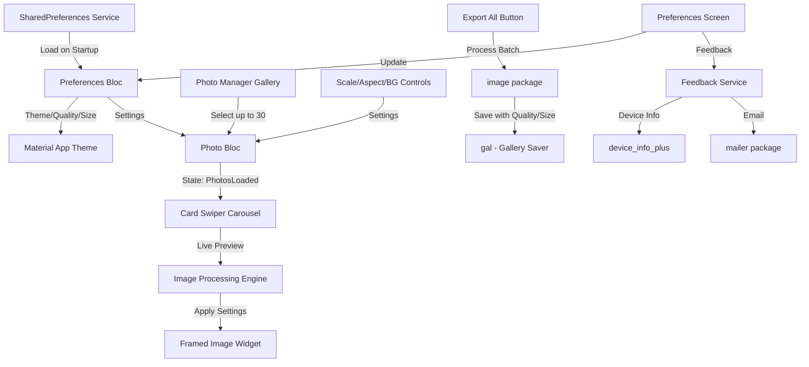

# Instagram Photo Framer - V1.0 MVP Implementation Plan

## Architecture Overview



## Core Components

### 1. Project Setup & Dependencies

**File: [`pubspec.yaml`](pubspec.yaml)**

Add dependencies:

- `flutter_bloc: ^8.1.3` - State management
- `photo_manager: ^3.0.0` + `wechat_assets_picker: ^9.0.0` - Multi-select gallery
- `image: ^4.1.0` - Image processing (resize, crop, blur)
- `card_swiper: ^3.0.1` - Carousel
- `gal: ^2.3.0` - Save to gallery
- `path_provider: ^2.1.0` - Temp file storage
- `shared_preferences: ^2.2.0` - Persist user preferences
- `mailer: ^6.0.0` - Send feedback emails
- `device_info_plus: ^10.0.0` - Get device info for feedback

Update `AndroidManifest.xml` with permissions:

- `READ_MEDIA_IMAGES` (Android 13+)
- `READ_EXTERNAL_STORAGE` (Android 12-)
- `WRITE_EXTERNAL_STORAGE` (Android 9-)

### 2. BLoC State Management Architecture

**Files to create:**

- `lib/blocs/photo_bloc/photo_bloc.dart`
- `lib/blocs/photo_bloc/photo_event.dart`
- `lib/blocs/photo_bloc/photo_state.dart`

**Events:**

- `LoadPhotosFromGallery` - Trigger photo picker
- `PhotosSelected(List<AssetEntity>)` - Store selected photos
- `UpdateSettings(aspectRatio, scale, bgType)` - Update processing settings
- `ExportAllPhotos` - Batch process and save

**States:**

- `PhotoInitial`
- `PhotosLoading`
- `PhotosLoaded(photos, settings, currentIndex)`
- `PhotosProcessing(progress)`
- `PhotosExported(count)`
- `PhotoError(message)`

**Settings Model:**

```dart
class PhotoSettings {
  final AspectRatio aspectRatio; // 4:5 or 1:1
  final double scale; // 0.0 to 1.0 (100% = fill completely)
  final BackgroundType bgType; // white, black, extendedBlur
  final int imageQuality; // 1-100 (JPEG quality)
  final ImageSize imageSize; // preset or custom dimensions
}
```

### 3. Gallery Picker Integration

**File: `lib/screens/photo_picker_screen.dart`**

Use `wechat_assets_picker` to:

- Multi-select up to 30 photos
- Request Android permissions (photo_manager)
- Return `List<AssetEntity>` to PhotoBloc
- Handle permission denied gracefully

### 4. Main Editor Screen

**File: `lib/screens/editor_screen.dart`**

Layout structure:

```
AppBar (title, photo count)
├─ CardSwiper (70% height)
│   └─ ProcessedImageWidget (shows live preview)
├─ Control Panel (30% height)
│   ├─ Aspect Ratio Buttons (4:5, 1:1)
│   ├─ Scale Slider (0-100%)
│   ├─ Background Chips (White, Black, Blur)
│   └─ Export All Button
└─ Page Indicator (1/30)
```

### 5. Image Processing Engine

**File: `lib/services/image_processor.dart`**

Core function:

```dart
Future<Uint8List> processImage(
  AssetEntity asset,
  PhotoSettings settings,
) async {
  // 1. Load original image bytes
  // 2. Decode using image package
  // 3. Calculate target dimensions (4:5 or 1:1)
  // 4. Create canvas with target size
  // 5. Apply background:
  //    - white/black: fill canvas
  //    - extendedBlur: extend edges + blur
  // 6. Scale and center original photo
  // 7. Encode to JPEG
  // 8. Return bytes
}
```

**Extended Blur Implementation:**

- Resize original to target dimensions (stretches edges)
- Apply Gaussian blur (radius ~25)
- Overlay scaled original photo on top

### 6. Live Preview Widget

**File: `lib/widgets/processed_image_widget.dart`**

- Displays current photo with applied settings
- Uses `FutureBuilder` to show loading while processing
- Caches processed images to avoid reprocessing on swipe-back
- Shows original photo dimensions as overlay

### 7. Export Functionality

**File: `lib/services/export_service.dart`**

Batch export flow:

1. Show progress dialog (0/30)
2. Process each photo sequentially (avoid memory issues)
3. Save to temp directory first
4. Use `gal` to save to gallery
5. Clean up temp files
6. Show completion snackbar

### 8. Preferences Screen & Settings

**File: `lib/screens/preferences_screen.dart`**

Settings available:

1. **Theme Mode** - Auto/Light/Dark (enum: `ThemeMode`)
2. **Image Quality Slider** - 1-100% (affects JPEG encoding)
3. **Image Size Presets:**
   - Instagram Portrait - 1080x1350
   - Instagram Square - 1080x1080
   - Instagram Landscape - 1080x566
   - High Quality Portrait - 1440x1800
   - High Quality Square - 1440x1440
   - Custom (dropdown reveals width/height inputs)
4. **Feedback Option** - Opens email composer with:
   - To: your-email@example.com
   - Subject: "InstaFrame Feedback"
   - Body pre-filled with: App version, Android version, device model, screen size

**File: `lib/blocs/preferences_bloc/preferences_bloc.dart`**

- Load preferences from `shared_preferences` on app start
- Events: `LoadPreferences`, `UpdateTheme`, `UpdateQuality`, `UpdateImageSize`
- States: `PreferencesLoaded(UserPreferences)`
- Persist changes immediately to storage

**File: `lib/services/feedback_service.dart`**

- Use `device_info_plus` to gather device details
- Use `mailer` package to compose email with pre-filled data
- Handle email app not available gracefully

### 9. UI/UX Polish

**Files:**

- `lib/theme/app_theme.dart` - Material 3 theme (light & dark variants)
- `lib/widgets/aspect_ratio_toggle.dart`
- `lib/widgets/background_selector.dart`
- `lib/widgets/scale_slider.dart`

Design principles:

- Respect user's theme preference (auto/light/dark)
- Large touch targets (min 48x48)
- Haptic feedback on selections
- Loading indicators for async operations

## File Structure

```
lib/
├── main.dart (MultiBlocProvider setup, routing)
├── blocs/
│   ├── photo_bloc/
│   │   ├── photo_bloc.dart
│   │   ├── photo_event.dart
│   │   └── photo_state.dart
│   └── preferences_bloc/
│       ├── preferences_bloc.dart
│       ├── preferences_event.dart
│       └── preferences_state.dart
├── models/
│   ├── photo_settings.dart
│   ├── user_preferences.dart
│   ├── image_size.dart
│   └── aspect_ratio.dart
├── screens/
│   ├── home_screen.dart
│   ├── photo_picker_screen.dart
│   ├── editor_screen.dart
│   └── preferences_screen.dart
├── widgets/
│   ├── processed_image_widget.dart
│   ├── aspect_ratio_toggle.dart
│   ├── background_selector.dart
│   └── scale_slider.dart
├── services/
│   ├── image_processor.dart
│   ├── export_service.dart
│   ├── preferences_service.dart
│   └── feedback_service.dart
└── theme/
    └── app_theme.dart
```

## Implementation Order

1. **Setup dependencies and permissions** - Get gallery access working
2. **Build BLoC architecture** - Events, states, models (Photo + Preferences)
3. **Implement preferences storage** - SharedPreferences service + PreferencesBloc
4. **Create preferences screen** - Theme, quality, size, feedback UI
5. **Implement photo picker** - Multi-select with wechat_assets_picker
6. **Create basic editor UI** - Carousel + control panel layout
7. **Build image processor** - White/black backgrounds (respecting quality/size settings)
8. **Add extended blur background** - Most complex processing
9. **Implement live preview** - Wire up carousel to processor
10. **Build export service** - Batch save to gallery with user's quality/size settings
11. **Add UI polish** - Loading states, progress, error handling
12. **Testing on Android device** - Permissions, memory, performance, all settings

## Key Technical Considerations

- **Memory Management:** Process images one at a time during export to avoid OOM
- **Permissions:** Handle Android 13+ granular photo permissions vs legacy storage
- **Image Quality:** JPEG encoding respects user's quality setting (default: 85%)
- **Image Size:** Target dimensions from user preferences (default: Instagram Portrait 1080x1350)
- **Performance:** Cache processed previews at lower resolution for carousel (max 30 images, ~5-10MB total)
- **Error Handling:** Graceful failures for corrupt images, permission denials
- **Theme Persistence:** Load user's theme preference before MaterialApp builds

## Testing Checklist

- [ ] Select 1, 10, 30 photos successfully
- [ ] Live preview updates smoothly when changing settings
- [ ] All aspect ratios render correctly (4:5, 1:1)
- [ ] White/black/blur backgrounds work on all image types
- [ ] Export saves all photos to gallery with correct quality/size
- [ ] App handles permission denial gracefully
- [ ] Theme switching works (auto/light/dark) and persists
- [ ] Image quality slider affects export file size
- [ ] All image size presets work correctly
- [ ] Custom image size accepts valid dimensions
- [ ] Feedback email opens with pre-filled device info
- [ ] Preferences persist across app restarts

